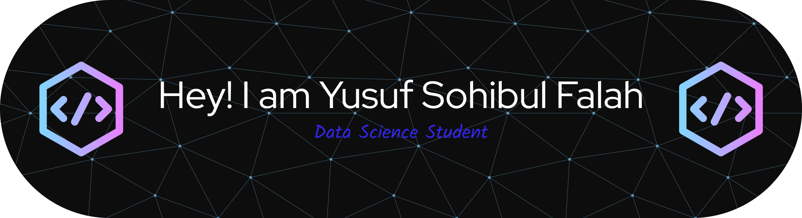

## Hi👋 I'm Yusuf

<!--
**yusufsf01/yusufsf01** is a ✨ _special_ ✨ repository because its `README.md` (this file) appears on your GitHub profile.

Here are some ideas to get you started:

-->
## ✨ About Me :

- 🌱 I’m currently learning Data Science

## 🌐 Social : 

![Discord] ({https://img.shields.io/badge/Discord-5865F2?style=for-the-badge&logo=discord&logoColor=white})

## 💻 Tech Stack :

## Github Stats
